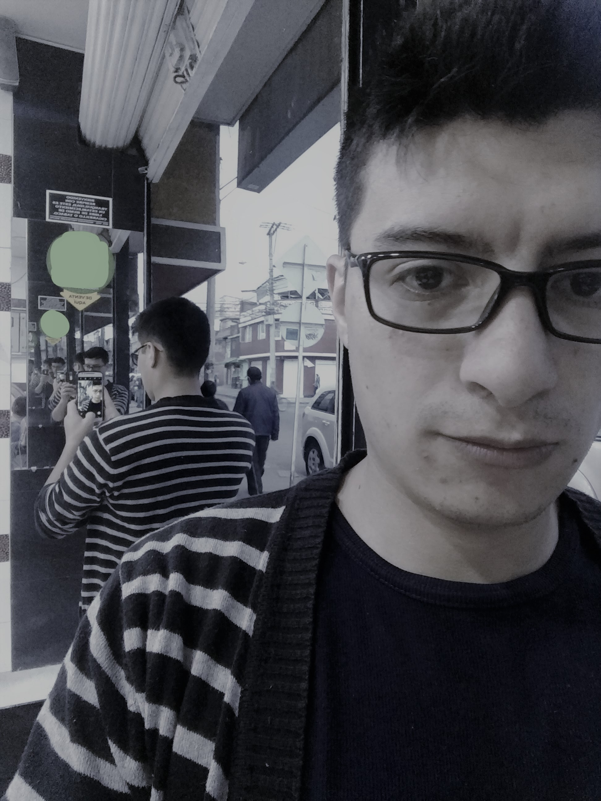

___

# ***Omar Roa***  

[GitHub](https://github.com/oeroaq)

___

## Perfil

Soy estudiante de Ingenieria de Sistemas y Computacion de la [Universidad Nacional de Colombia](http://unal.edu.co/), actualmente curso noveno semestre de esta ingenieria. He tenido la fortuna de poder ejercer los conocimientos adquiridos durante mi instancia en la universidad en la industria del software con [Grupo Cubo](http://grupo-cubo.com/gcubo/index.php) durante los ultimos 2 años y tambien en la Oficina de TIC's de la [Facultad de Ingenieria](https://www.ingenieria.bogota.unal.edu.co/) durante los ultmos 6 meses.

## Intereses Profesionales

* Arquitectura de Software
* Lenguajes de programacion
* Seguridad de la informacion y de las Comunicaciones
* Inteligencia artificial
* Simulacion
* Sistemas Operativos
* Computacion Paralela

## Lenguajes

* Avanzados

    * C#
    * Python
    * Ruby
    * JavaScript
    * HTML
    * SQL
    * C y C++
    * Bash
    * CSS
    * Latex

* Basicos

    * N1SQL
    * Markdown
    * Java
    * Visual Basic
    * Power Shell
    * Go
    * Matlab - Scilab - Octave (Matematicos)

## Proyectos

* ### [Home](https://github.com/oeroaq/IronHack-oeroaq)

Ganador del Best Solution en el primer [IronHacks](http://www.ironhacks.com/) entre la [Universidad de Purdue](https://www.purdue.edu/) y la [Universidad Nacional de Colombia](http://unal.edu.co/) en donde se buscaba escoger el sitio mas barato, seguro y acogedor para estudiantes recien llegados a la universidad en Chicago.

 * ### [gskEspañol](https://github.com/oeroaq/gskEspanol)

Proyecto final de la Asignatura Lenguajes de Programacion de la [Universidad Nacional de Colombia](http://unal.edu.co/) en donde se realiza una aproximacion a un lenguaje que resuelve sistemas de programacion lineal con dependencias entre cada uno de los modelos.

* ### [Oxygen](https://github.com/Dev02Unal/Oxygen)

Aplicacion para poder hacer eventos dentro del capus universitario y poder comunicarlo a las demas personas, esta app fue desarrollada en conjunto con el equipo [DevO2](https://github.com/Dev02Unal) para la asignatura Ingenieria de Software 2 de la [Universidad Nacional de Colombia](http://unal.edu.co/)

* ### [BlurParalelismo](https://github.com/fevargasmo/Efecto-blur-con-diferentes-metodos-de-paralelismo)
Aplicar efecto blur a imagenes con diferentes metodos de paralelismo; Hilos, Pymp, CUDA. Para la asignatura Computacion Paralela y Distribuida de la [Universidad Nacional de Colombia](http://unal.edu.co/), el repositorio inicial esta en GitLab [BlurParalelismo](https://gitlab.com/oeroaq/paralela.git)

